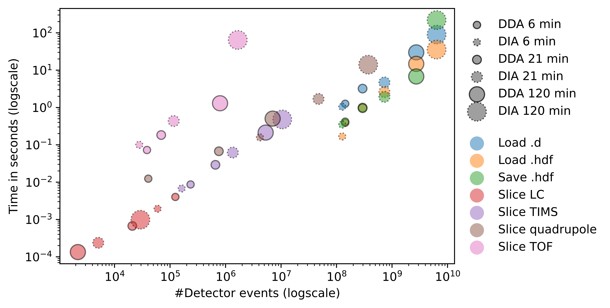

[](https://pepy.tech/project/alphatims)
[](https://pepy.tech/project/alphatims)
[](https://pepy.tech/project/alphatims)
[](https://alphatims.readthedocs.io/en/latest/?badge=latest)

---
# AlphaTims

AlphaTims is an open-source Python package that provides fast accession and visualization of unprocessed LC-TIMS-Q-TOF data from [Bruker’s timsTOF Pro](https://www.bruker.com/en/products-and-solutions/mass-spectrometry/timstof/timstof-pro.html) instruments. It indexes the data such that it can easily be sliced along all five dimensions: LC, TIMS, QUADRUPOLE, TOF and DETECTOR. It was developed by the [Mann Labs at the Max Planck Institute of Biochemistry](https://www.biochem.mpg.de/mann) as a modular tool of the [AlphaPept ecosystem](https://github.com/MannLabs/alphapept). To enable all hyperlinks in this document, please view it at [GitHub](https://github.com/MannLabs/alphatims).

* [**AlphaTims**](#alphatims)
  * [**About**](#about)
  * [**License**](#license)
  * [**Installation**](#installation)
     * [**One-click GUI**](#one-click-gui)
     * [**Pip installer**](#pip)
     * [**Developer installer**](#developer)
     * [**Installation issues**](#installation-issues)
  * [**Test data**](#test-data)
    * [**Test sample**](#test-sample)
    * [**LC**](#lc)  
    * [**DDA**](#dda)
    * [**DIA**](#dia)
  * [**Usage**](#usage)
    * [**GUI**](#gui)
    * [**CLI**](#cli)
    * [**Python and jupyter notebooks**](#python-and-jupyter-notebooks)
    * [**Other tools**](#other-tools)
  * [**Performance**](#performance)
    * [**Speed**](#speed)
    * [**RAM**](#ram)
  * [**Troubleshooting**](#troubleshooting)
  * [**How it works**](#how-it-works)
    * [**Bruker raw data**](#bruker-raw-data)
    * [**TimsTOF objects in Python**](#timstof-objects-in-python)
    * [**Slicing TimsTOF objects**](#slicing-timstof-objects)
  * [**Future perspectives**](#future-perspectives)
  * [**Citing AlphaTims**](#citing-alphatims)
  * [**How to contribute**](#how-to-contribute)
  * [**Changelog**](#changelog)
    * [**1.0.0**](#100)
    * [**0.3.2**](#032)
    * [**0.3.1**](#031)
    * [**0.3.0**](#030)
    * [**0.2.8**](#028)
    * [**0.2.7**](#027)

---
## About

High-resolution quadrupole time-of-flight (Q-TOF) tandem mass spectrometry can be coupled to several other analytical techniques such as liquid chromatography (LC) and trapped ion mobility spectrometry (TIMS). LC-TIMS-Q-TOF has gained considerable interest since the introduction of the [Parallel Accumulation–Serial Fragmentation (PASEF)](https://doi.org/10.1074/mcp.TIR118.000900) method in both data-dependent ([DDA](https://pubs.acs.org/doi/abs/10.1021/acs.jproteome.5b00932)) and data-independent acquisition ([DIA](https://www.nature.com/articles/s41592-020-00998-0)). With this setup, ion intensity values are acquired as a function of the chromatographic retention time, ion mobility, quadrupole mass to charge and TOF mass to charge. As these five-dimensional data points are detected at GHz rates, datasets often contain billions of data points which makes them impractical and slow to access. Raw data are therefore frequently binned for faster data analysis or visualization. In contrast, AlphaTims is a Python package that provides fast accession and visualization of unprocessed raw data. By recognizing that all measurements are ultimately arrival times linked to intensity values, it constructs an efficient set of indices such that raw data can be interpreted as a sparse five-dimensional matrix. On a modern laptop, this indexing takes less than half a minute for raw datasets of more than two billion datapoints. Following this step, interactive visualization of the same dataset can also be done in milliseconds. AlphaTims is freely available, open-source and available on all major Operating Systems. It can be used with a graphical user interface (GUI), a command-line interface (CLI) or as a regular Python package.

---
## License

AlphaTims was developed by the [Mann Labs at the Max Planck Institute of Biochemistry](https://www.biochem.mpg.de/mann) and is freely available with an [Apache License](LICENSE.txt). Since AlphaTims uses Bruker libraries (available in the [alphatims/ext](alphatims/ext) folder) additional [third-party licenses](LICENSE-THIRD-PARTY.txt) are applicable. External Python packages (available in the [requirements](requirements) folder) have their own licenses, which can be consulted on their respective websites.

---
## Installation

AlphaTims can be installed and used on all major operating systems (Windows, macOS and Linux).
There are three different types of installation possible:

* [**One-click GUI installer:**](#one-click-gui) Choose this installation if you only want the GUI and/or keep things as simple as possible.
* [**Pip installer:**](#pip) Choose this installation if you want to use AlphaTims as a Python package in an existing Python 3.8 environment (e.g. a Jupyter notebook). If needed, the GUI and CLI can be installed with pip as well.
* [**Developer installer:**](#developer) Choose this installation if you are familiar with CLI tools, [conda](https://docs.conda.io/en/latest/) and Python. This installation allows access to all available features of AlphaTims and even allows to modify its source code directly. Generally, the developer version of AlphaTims outperforms the precompiled versions which makes this the installation of choice for high-throughput experiments.

***IMPORTANT: While AlphaTims is mostly platform independent, some calibration functions require [Bruker libraries](alphatims/ext) which are only available on Windows and Linux.***

### One-click GUI

The GUI of AlphaTims is a completely stand-alone tool that requires no knowledge of Python or CLI tools. Click on one of the links below to download the latest release for:

* [**Windows**](https://github.com/MannLabs/alphatims/releases/latest/download/alphatims_gui_installer_windows.exe)
* [**macOS**](https://github.com/MannLabs/alphatims/releases/latest/download/alphatims_gui_installer_macos.pkg)
* [**Linux**](https://github.com/MannLabs/alphatims/releases/latest/download/alphatims_gui_installer_linux.deb)

***IMPORTANT: Please refer to the [GUI manual](alphatims/docs/gui_manual.pdf) for detailed instructions on the installation, troubleshooting and usage of the stand-alone AlphaTims GUI.***

Older releases remain available on the [release page](https://github.com/MannLabs/alphatims/releases), but no backwards compatibility is guaranteed.

### Pip

AlphaTims can be installed in an existing Python 3.8 environment with a single `bash` command. *This `bash` command can also be run directly from within a Jupyter notebook by prepending it with a `!`*. The lightweight version of AlphaTims that purely focuses on data accession (no plotting without additional packages) can be installed with:

```bash
pip install alphatims
```

Installing AlphaTims like this avoids conflicts when integrating it in other tools, as this does not enforce strict versioning of dependancies. However, if new versions of dependancies are released, they are not guaranteed to be fully compatible with AlphaTims. While this should only occur in rare cases where dependencies are not backwards compatible, you can always force AlphaTims to use dependancy versions which are known to be compatible with:

```bash
pip install "alphatims[stable]"
```

NOTE: You might need to run `pip install pip==21.0` before installing AlphaTims like this. Also note the double quotes `"`.

Alternatively, some basic plotting functions can be installed with the following command:

```bash
pip install "alphatims[plotting]"
```

While the above command does allow usage of the full GUI, there are some known compatability issues with newer versions of bokeh. As such, it is generally advised to not use loose plotting dependancies and force a stable installation with:

```bash
pip install "alphatims[plotting-stable]"
```

When older samples need to be analyzed, it might be essential to install the `legacy` version as well (See also the [troubleshooting](#troubleshooting) section):

```bash
pip install "alphatims[legacy]"
```

When a new version of AlphaTims becomes available, the old version can easily be upgraded by running e.g. the command again with an additional `--upgrade` flag:

```bash
pip install "alphatims[plotting,legacy,stable]" --upgrade
```

The following extra options are available:

* `stable`
* `plotting`
* `plotting-stable`
* `legacy`
* `legacy-stable`
* `development`
* `development-stable`

NOTE: Multiple dependancy packs can be installed by comma-separation. Note however that this only works without spaces!

### Developer

AlphaTims can also be installed in editable (i.e. developer) mode with a few `bash` commands. This allows to fully customize the software and even modify the source code to your specific needs. When an editable Python package is installed, its source code is stored in a transparent location of your choice. While optional, it is advised to first (create and) navigate to e.g. a general software folder:

```bash
mkdir ~/folder/where/to/install/software
cd ~/folder/where/to/install/software
```

***The following commands assume you do not perform any additional `cd` commands anymore***.

Next, download the AlphaTims repository from GitHub either directly or with a `git` command. This creates a new AlphaTims subfolder in your current directory.

```bash
git clone https://github.com/MannLabs/alphatims.git
```

For any Python package, it is highly recommended to use a [conda virtual environment](https://docs.conda.io/en/latest/). The best way to install an editable version of AlphaTims is to use AlphaTims' pre-built conda development environment (note that the `--force` flag overwrites an already existing AlphaTims environment):

```bash
conda env create --force --name alphatims --file alphatims/misc/conda_development_environment.yaml
conda activate alphatims
```

Alternatively, a new conda environment can manually be created or AlphaTims can be installed in an already existing environment. *Note that dependancy conflicts can occur with already existing packages in the latter case*! Once a conda environment is activated, AlphaTims and all its [dependancies](requirements) need to be installed. To take advantage of all features and allow development (with the `-e` flag), this is best done by installing both the [plotting dependencies](requirements/requirements_plotting.txt) and [development dependencies](requirements/requirements_development.txt) instead of only the [core dependencies](requirements/requirements.txt):

```bash
conda create -n alphatims python=3.8 -y
conda activate alphatims
pip install -e "./alphatims[plotting-stable,development]"
```

***By using the editable flag `-e`, all modifications to the AlphaTims [source code folder](alphatims) are directly reflected when running AlphaTims. Note that the AlphaTims folder cannot be moved and/or renamed if an editable version is installed.***

The following steps are optional, but make working with AlphaTims slightly more convenient:

* To avoid calling `conda activate alphatims` and `conda deactivate` every time AlphaTims is used, the binary execution (which still reflects all modifications to the source code) can be added as an alias. On linux and MacOS, this can be done with e.g.:
  ```bash
  conda activate alphatims
  alphatims_bin="$(which alphatims)"
  echo "alias alphatims='"${alphatims_bin}"'" >> ~/.bashrc
  conda deactivate
  ```
  When `zsh` is the default terminal instead of `bash`, replace `~/.bashrc` with `~/.zshrc`. On Windows, the command `where alphatims` can be used to find the location of the binary executable. This path can then be (permanently) added to Windows' path variable.
* When using Jupyter notebooks and multiple conda environments direcly from the terminal, it is recommended to `conda install nb_conda_kernels` in the conda base environment. Hereafter, running a `jupyter notebook` from the conda base environment should have a `python [conda env: alphatims]` kernel available, in addition to all other conda kernels in which the command `conda install ipykernel` was run.

### Installation issues

See the general [troubleshooting](#troubleshooting) section.

---
## Test data

AlphaTims is compatible with both [ddaPASEF](https://pubs.acs.org/doi/abs/10.1021/acs.jproteome.5b00932) and [diaPASEF](https://www.nature.com/articles/s41592-020-00998-0).

### Test sample

A test sample of human cervical cancer cells (HeLa, S3, ATCC) is provided for AlphaTims. These cells were cultured in Dulbecco's modified Eagle's medium (all Life Technologies Ltd., UK). Subsequently, the cells were collected, washed, flash-frozen, and stored at -80 °C.
Following the previously published [in-StageTip protocol](https://www.nature.com/articles/nmeth.2834), cell lysis, reduction, and alkylation with chloroacetamide were carried out simultaneously in a lysis buffer (PreOmics, Germany). The resultant dried peptides were reconstituted in water comprising 2 vol% acetonitrile and 0.1% vol% trifluoroacetic acid, yielding a 200 ng/µL solution. This solution was further diluted with water containing 0.1% vol% formic acid. The manufacturer's instructions were followed to load approximately 200ng peptides onto Evotips (Evosep, Denmark).

### LC

Single-run LC-MS analysis was executed via an [Evosep One LC system (Evosep)](https://doi.org/10.1074/mcp.TIR118.000853). This was coupled online with a hybrid [TIMS quadrupole TOF mass spectrometer (Bruker timsTOF Pro, Germany)](https://doi.org/10.1074/mcp.TIR118.000900). A silica emitter (Bruker) was placed inside a nano-electrospray ion source (Captive spray source, Bruker) and connected to an 8 cm x 150 µm reverse phase column to perform LC. The column was packed with 1.5 µm C18-beads (Pepsep, Denmark). Mobile phases were water and acetonitrile, buffered with 0.1% formic acid. The samples were separated with a predefined 60 samples per day method (Evosep).

### DDA

A ddaPASEF dataset is available for [download from the release page](https://github.com/MannLabs/alphatims/releases/download/0.1.210317/20201207_tims03_Evo03_PS_SA_HeLa_200ng_EvoSep_prot_DDA_21min_8cm_S1-C10_1_22476.d.zip). Each topN acquisition cycle consisted of 10 PASEF MS/MS scans, and the accumulation and ramp times were set to 100 ms. Single-charged precursors were excluded using a polygon filter in the m/z-ion mobility plane. Furthermore, all precursors, which reached the target value of 20000, were excluded for 0.4 min from the acquisition. Precursors were isolated with a quadrupole window of 2 Th for m/z <700 and 3 Th for m/z >700.

### DIA

The same sample was acquired with diaPASEF and is also available for [download from the release page](https://github.com/MannLabs/alphatims/releases/download/0.1.210317/20201207_tims03_Evo03_PS_SA_HeLa_200ng_EvoSep_prot_high_speed_21min_8cm_S1-C8_1_22474.d.zip). The "high-speed" method (mass range: m/z 400 to 1000, 1/K0: 0.6 – 1.6 Vs cm- 2, diaPASEF windows: 8 x 25 Th) was used, as described in [Meier et al](https://www.nature.com/articles/s41592-020-00998-0).

---
## Usage

There are three ways to use AlphaTims:

* [**GUI:**](#gui) This allows to interactively browse, visualize and export the data.
* [**CLI:**](#cli) This allows to incorporate AlphaTims in automated workflows.
* [**Python:**](#python-and-jupyter-notebooks) This allows to access data and explore it interactively with custom code.

NOTE: The first time you use a fresh installation of AlphaTims, it is often quite slow because some functions might still need compilation on your local operating system and architecture. Subsequent use should be a lot faster.

### GUI

Please refer to the [GUI manual](alphatims/docs/gui_manual.pdf) for detailed instructions on the installation, troubleshooting and usage of the stand-alone AlphaTims GUI.

If the GUI was not installed through a one-click GUI installer, it can be activate with the following `bash` command:

```bash
alphatims gui
```

Note that this needs to be prepended with a `!` when you want to run this from within a Jupyter notebook. When the command is run directly from the command-line, make sure you use the right environment (activate it with e.g. `conda activate alphatims` or set an alias to the binary executable).

### CLI

The CLI can be run with the following command (after activating the `conda` environment with `conda activate alphatims` or if an alias was set to the alphatims executable):

```bash
alphatims -h
```

It is possible to get help about each function and their (required) parameters by using the `-h` flag. For instance, the command `alphatims export hdf -h` will produce the following output:

```
************************
* AlphaTims 0.0.210310 *
************************
Usage: alphatims export hdf [OPTIONS] BRUKER_D_FOLDER

  Export BRUKER_D_FOLDER as hdf file.

Options:
  --disable_overwrite            Disable overwriting of existing files.
  --enable_compression           Enable compression of hdf files. If set, this
                                 roughly halves files sizes (on-disk), at the
                                 cost of taking 2-10 longer accession times.
  -o, --output_folder DIRECTORY  A directory for all output (blank means
                                 `input_file` root is used).
  -l, --log_file PATH            Save all log data to a file (blank means
                                 'log_[date].txt' with date format
                                 yymmddhhmmss in 'log' folder of AlphaTims
                                 directory).  [default: ]
  -t, --threads INTEGER          The number of threads to use (0 means all,
                                 negative means how many threads to leave
                                 available).  [default: -1]
  -s, --disable_log_stream       Disable streaming of log data.
  -p, --parameter_file FILE      A .json file with (non-required) parameters
                                 (blank means default parameters are used).
                                 NOTE: Parameters defined herein override all
                                 default and given CLI parameters.
  -e, --export_parameters FILE   Save currently selected parameters to a
                                 parameter file.
  -h, --help                     Show this message and exit.
```

For this particular command, the line `Usage: alphatims export hdf [OPTIONS] BRUKER_D_FOLDER` shows that you always need to provide a path to a `BRUKER_D_FOLDER` and that all other options are optional (indicated by the brackets in `[OPTIONS]`). Each option can be called with a double dash `--` followed by a long name, while common options also can be called with a single dash `-` followed by their short name. It is indicated what type of parameter is expected, e.g. a `DIRECTORY` for `--output_folder` or nothing for `enable/disable` flags. Defaults are also shown and all parameters will be saved in a log file. Alternatively, all used parameters can be exported with the `--export_parameters` option and the non-required ones can be reused with the `--parameter_file`.

***IMPORTANT: Please refer to the [CLI manual](alphatims/docs/cli_manual.pdf) for detailed instructions on the usage and troubleshooting of the stand-alone AlphaTims CLI.***

### Python and Jupyter notebooks

AlphaTims can be imported as a Python package into any Python script or notebook with the command `import alphatims`. Documentation for all functions is available in the [Read the Docs API](https://alphatims.readthedocs.io/en/latest/index.html).

A brief [Jupyter notebook tutorial](nbs/tutorial.ipynb) on how to use the API is also present in the [nbs folder](nbs). When running locally it provides interactive plots, which are not rendered on GitHub. Instead, they are available as individual html pages in the [nbs folder](nbs).

### Other tools

* Initial exploration of Bruker TimsTOF data files can be done by opening the .tdf file in the .d folder with an [SQL browser](https://sqlitebrowser.org/).
* [HDF files](https://www.hdfgroup.org/solutions/hdf5/) can be explored with [HDF Compass](https://support.hdfgroup.org/projects/compass/) or [HDFView](https://www.hdfgroup.org/downloads/hdfview/).
* Annotating Bruker TimsTOF data files can be done with [AlphaPept](https://github.com/MannLabs/alphapept)
* Visualization of identified Bruker TimsTOF data files can be done with [AlphaViz](https://github.com/MannLabs/alphaviz)

---
## Performance

Performance can be measured in function of [speed](#speed) or [RAM](#ram) usage.

### Speed

Typical time performance statistics on data in-/output and slicing of standard [HeLa datasets](#test-sample) are available in the [performance notebook](nbs/performance.ipynb). All result can be summarized as follows:



### RAM

On average, RAM usage is twice the size of a raw Bruker .d folder. Since most .d folders have file sizes of less than 10 Gb, a modern computer with 32 Gb RAM suffices to explore most datasets with ease.

---
## Troubleshooting

Common installation/usage issues include:

* **Always make sure you have activated the AlphaTims environment with `conda activate alphatims`.** If this fails, make sure you have installed [conda](https://docs.conda.io/en/latest/) and have created an AlphaTims environment with `conda create -n alphatims python=3.8`.
* **No `git` command**. Make sure [git](https://git-scm.com/downloads) is installed. In a notebook `!conda install git -y` might work.
* **Wrong Python version.** AlphaTims is only guaranteed to be compatible with Python 3.8. You can check if you have the right version with the command `python --version` (or `!python --version` in a notebook). If not, reinstall the AlphaTims environment with `conda create -n alphatims python=3.8`.
* **Dependancy conflicts/issues.** Pip changed their dependancy resolver with [pip version 20.3](https://pip.pypa.io/en/stable/news/). Downgrading or upgrading pip to version 20.2 or 21.0 with `pip install pip==20.2` or `pip install pip==21.0` (before running `pip install alphatims`) could solve dependancy conflicts.
* **AlphaTims is not found.** Make sure you use the right folder. Local folders are best called by prefixing them with `./` (e.g. `pip install "./alphatims"`). On some systems, installation specifically requires (not) to use single quotes `'` around the AlphaTims folder, e.g. `pip install "./alphatims[plotting-stable,development]"`.
* **Modifications to the AlphaTims source code are not reflected.** Make sure you use the `-e` flag when using `pip install -e alphatims`.
* **Numpy does not work properly.** On Windows, `numpy==1.19.4` has some issues. After installing AlphaTims, downgrade NumPy with `pip install numpy==1.19.3`.
* **Exporting PNG images with the CLI or Python package might not work out-of-the-box**. If a conda environment is used, this can be fixed by running `conda install -c conda-forge firefox geckodriver` in the AlphaTims conda environment. Alternatively, a file can be exported as html and opened in a browser. From the browser there is a `save as png` button available.
* **GUI does not open.** In some cases this can be simply because of using an incompatible (default) browser. AlphaTims has been tested with Google Chrome and Mozilla Firefox. Windows IE and Windows Edge compatibility is not guaranteed.
* **When older Bruker files need to be processed as well,** the [legacy dependencies](requirements/requirements_legacy.txt) are also needed. However, note that this requires [Microsoft Visual C++](https://visualstudio.microsoft.com/visual-cpp-build-tools) to be manually installed (on Windows machines) prior to AlphaTims installation! To include the legacy dependencies, install AlphaTims with `pip install "alphatims[legacy]"` or `pip install "alphatims[legacy]" --upgrade` if already pre-installed.
* **When installed through `pip`, the GUI cannot be started.** Make sure you install AlphaTims with `pip install "alphatims[plotting-stable]"` to include the GUI with stable dependancies. If this was done and it still fails to run the GUI, a possible fix might be to run `pip install panel==0.10.3` after AlphaTims was installed.

---
## How it works

The basic workflow of AlphaTims looks as follows:

* Read data from a [Bruker `.d` folder](#bruker-raw-data).
* Convert data to a [TimsTOF object in Python](#timstof-objects-in-python) and optionally store them as a persistent [HDF5 file](https://www.hdfgroup.org/solutions/hdf5/).
* Use Python's [slicing mechanism](#slicing-timstof-objects) to retrieve data from this object e.g. for visualisation.

Also checkout:

* The [paper](https://doi.org/10.1016/j.mcpro.2021.100149) for a complete overview.
* The [presentation](https://datashare.biochem.mpg.de/s/JlVKCvLHdQjsVZU) at [ISCB](https://www.iscb.org/ismbeccb2021) for a brief video.

### Bruker raw data

Bruker stores TimsTOF raw data in a `.d` folder. The two main files in this folder are `analysis.tdf` and `analysis.tdf_bin`.

The `analysis.tdf` file is an SQL database, in which all metadata are stored together with summarised information. This includes the `Frames` table, wherein information about each individual TIMS cycle is summarised including the retention time, the number of scans (i.e. a single TOF push is related to a single ion mobility value), the summed intensity and the total number of ions that have hit the detector. More details about individual scans of the frames are available in the `PasefFrameMSMSInfo` (for PASEF acquisition) or `DiaFrameMsMsWindows` (for diaPASEF acquisition) tables. This includes quadrupole and collision settings of the frame/scan combinations.

The `analysis.tdf_bin` file is a binary file that contains the number of detected ions per individual scan, all detector arrival times and their intensity values. These values are grouped and compressed per frame (i.e. TIMS cycle), thereby allowing fast appendage during online acquisition.

### TimsTOF objects in Python

AlphaTims first reads relevant metadata from the `analysis.tdf` SQL database and creates a Python object of the `bruker.TimsTOF` class. Next, AlphaTims reads the summary information from the `Frames` table and creates three empty arrays:

* An empty `tof_indices` array, in which all TOF arrival times of each individual detector hit will be stored. Its size is determined by summing the number of detector hits for all frames.
* An empty `intensities` array of the same size, in which all intensity values of each individual detector hit will be stored.
* An empty `tof_indptr` array, that will store the number of detector hits per scan. Its size is equal to `(frame_max_index + 1) * scans_max_index + 1`. It includes one additional frame to compensate for the fact that Bruker arrays are 1-indexed, while Python uses 0-indexing. The final `+1` is because this array will be converted to an offset array, similar to the index pointer array of a [compressed sparse row matrix](https://en.wikipedia.org/wiki/Sparse_matrix#Compressed_sparse_row_%28CSR,_CRS_or_Yale_format%29). Typical values are `scans_max_index = 1000` and `frame_max_index = gradient_length_in_seconds * 10`, resulting in approximately `len(tof_indptr) = 10000 * gradient_length_in_seconds`.

After reading the `PasefFrameMSMSInfo` or `DiaFrameMsMsWindows` table from the `analysis.tdf` SQL database, four arrays are created:

* A `quad_indptr` array that indexes the `tof_indptr` array. Each element points to an index of the `tof_indptr` where the voltage on the quadrupole and collision cell is adjusted. For PASEF acquisitions, this is typically 20 times per MSMS frame (turning on and off a value for 10 precursor selections) and once per change from an MS (precursor) frame to an MSMS (fragment) frame. For diaPASEF, this is typically twice to 10 times per frame and with a repetitive pattern over the frame cycle. This results in an array of approximately `len(quad_indptr) = 100 * gradient_length_in_seconds`. As with the `tof_indptr` array, this array is converted to an offset array with size `+1`.
* A `quad_low_values` array of `len(quad_indptr) - 1`. This array stores the lower m/z boundary that is selected with the quadrupole. For precursors without quadrupole selection, this value is set to -1.
* A `quad_high_values` array, similar to `quad_low_values`.
* A `precursor_indices` array of `len(quad_indptr) - 1`. For PASEF this array stores the index of the selected precursor. For diaPASEF, this array stores the `WindowGroup` of the fragment frame. A value of 0 indicates an MS1 ion (i.e. precursor) without quadrupole selection.

After processing this summarising information from the `analysis.tdf` SQL database, the actual raw data from the `analysis.tdf_bin` binary file is read and stored in the empty `tof_indices`, `intensities` and `tof_indptr` arrays.

Finally, three arrays are defined that allow quick translation of `frame_`, `scan_` and `tof_indices` to `rt_values`, `mobility_values` and `mz_values` arrays.
* The `rt_values` array is read read directly from the `Frames` table in `analysis.tdf` and has a length equal to `frame_max_index + 1`. Note that an empty zeroth frame with `rt = 0` is created to make Python's 0-indexing compatible with Bruker's 1-indexing.
* The `mobility_values` array is defined by using the function `tims_scannum_to_oneoverk0` from `timsdata.dll` on the first frame and typically has a length of `1000`.
* Similarly, the `mz_values` array is defined by using the function `tims_index_to_mz` from `timsdata.dll` on the first frame. Typically this has a length of `400000`.

All these arrays can be loaded into memory, taking up roughly twice as much RAM as the `.d` folder on disk. This increase in RAM memory is mainly due to the compression used in the `analysis.tdf_bin` file. The HDF5 file can also be compressed so that its size is roughly halved and thereby has the same size as the Bruker `.d` folder, but (de)compression reduces accession times by 3-6 fold.

### Slicing TimsTOF objects

Once a Python TimsTOF object is available, it can be loaded into memory for ultrafast accession. Accession of the `data` object is done by simple Python slicing such as e.g. `selected_ion_indices = data[frame_selection, scan_selection, quad_selection, tof_selection]`. This slicing returns a `pd.DataFrame` for subsequent analysis. The columns of this dataframe contain all information for all selected ions, i.e. `frame`, `scan`, `precursor` and `tof` indices and `rt`, `mobility`, `quad_low`, `quad_high`, `mz` and `intensity` values. See the [tutorial jupyter notebook](nbs/tutorial.ipynb) for usage examples.

---
## Future perspectives

* Detection of:
  * precursor and fragment ions
  * isotopic envelopes (i.e. features)
  * fragment clusters (i.e. pseudo MSMS spectra)

---
## Citing AlphaTims

Check out the [paper](https://doi.org/10.1016/j.mcpro.2021.100149).

---
## How to contribute

If you like AlphaTims you can give us a [star](stargazers) to boost our visibility! All direct contributions are also welcome. Feel free to post a new [issue](https://github.com/MannLabs/alphabase/issues) or clone the repository and create a [pull request](https://github.com/MannLabs/alphabase/pulls) with a new branch. For an even more interactive participation, check out the [discussions](https://github.com/MannLabs/alphabase/discussions).
For more information see [the Contributors License Agreement](misc/CLA.md).

---
## Changelog

The following changes were introduced in the following versions of AlphaTims. Download the latest version in the [installation section](#installation).

### 1.0.0

  * FEAT: tempmmap for large arrays by default.

### 0.3.2

  * FEAT: cli/gui allow bruker data as argument.
  * FEAT/FIX: Polarity included in frame table.
  * FIX: utils cleanup.
  * FIX: utils issues.
  * FEAT: by default use -1 threads in utils.
  * FIX: disable cla check.

### 0.3.1

  * FIX/FEAT: Intensity correction when ICC is used. Note that this is only for exported data, not for visualized data.
  * FEAT: By default, hdf files are now mmapped, making them much faster to initially load and use virtual memory in favor of residual memory.

### 0.3.0

  * FEAT: Introduction of global mz calibration.
  * FEAT: Introduction of dia_cycle for diaPASEF.
  * CHORE: Verified Python 3.9 compatibility.
  * FEAT: Included option to open Bruker raw data when starting the GUI.
  * FEAT: Provided hash for TimsTOF objects.
  * FEAT: Filter push indices.
  * CHORE: included stable and loose versions for all dependancies

### 0.2.8

  * FIX: Ensure stable version for one click GUI.
  * FIX: Do not require plotting dependancies for CLI export csv selection.
  * FIX: Import of very old diaPASEF samples where the analysis.tdf file still looks like ddaPASEF.
  * FIX: frame pointers of fragment_frame table.
  * FEAT: Include visual report in performance notebook.
  * FEAT: Include DIA 120 sample in performance tests.
  * FEAT: Show performance in README.
  * FIX: Move python-lzf dependancy (to decompress older Bruker files) to legacy requirements, as pip install on Windows requires visual c++ otherwise.
  * DOCS: BioRxiv paper link.
  * FEAT/FIX: RT in min column.
  * FEAT: CLI manual.
  * FEAT: Inclusion of more coordinates in CLI.

### 0.2.7

  * CHORE: Introduction of changelog.
  * CHORE: Automated publish_and_release action to parse version numbers.
  * FEAT/FIX: Include average precursor mz in MGF titles and set unknown precursor charges to 0.
  * FIX: Properly resolve set_global argument of `alphatims.utils.set_threads`.
  * FIX: Set nogil option for `alphatims.bruker.indptr_lookup`.
  * DOCS: GUI Manual typos.
  * FEAT: Include buttons to download test data and citation in GUI.
  * FEAT: Include option for progress_callback in alphatims.utils.pjit.
  * FIX/FEAT: Older samples with TimsCompressionType 1 can now also be read. This is at limited performance.
  * FEAT: By default use loose versioning for the base dependancies. Stable dependancy versions can be enforced with `pip install "alphatims[stable]"`. NOTE: This option is not guaranteed to be maintained. Future AlphaTims versions might opt for an intermediate solution with semi-strict dependancy versioning.
