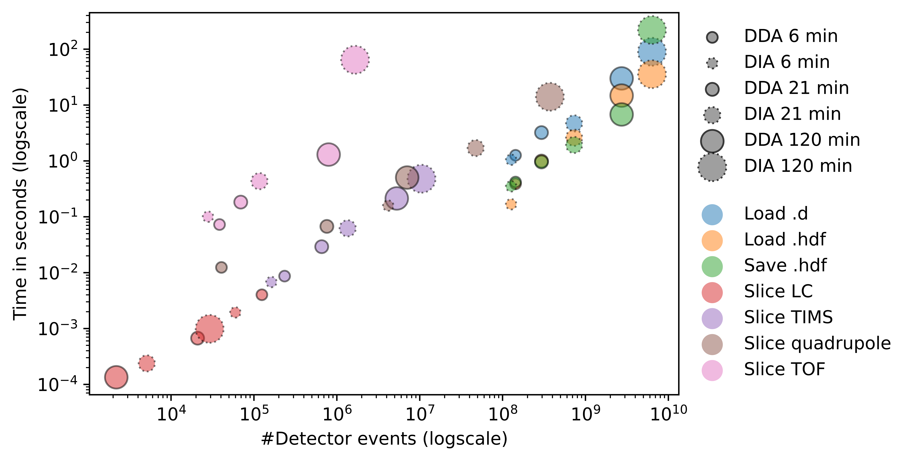

[](https://pepy.tech/project/alphatims)
[](https://pepy.tech/project/alphatims)
[](https://pepy.tech/project/alphatims)
[](https://alphatims.readthedocs.io/en/latest/?badge=latest)
[](https://github.com/MannLabs/alphatims/releases)
[](https://pypi.org/project/alphatims)


# AlphaTims

---

<!-- PROJECT LOGO -->
<br />
<div align="center">
  

  <h3 align="center">AlphaTims</h3>

  <p align="center">
    <a href="https://doi.org/10.1016/j.mcpro.2021.100149">Publication</a>
    ·
    <a href="https://github.com/Mannlabs/alphatims/releases/latest">Download</a>
    ·
    <a href="#installation">Installation</a>
    ·
    <a href="#usage">Usage</a>
    ·
    <a href="https://alphatims.readthedocs.io/en/latest/">Documentation</a>
    ·
    <a href="https://alphapept.org">alphapept.org</a>

  </p>
</div>


AlphaTims is an open-source Python package that provides fast accession and visualization of unprocessed LC-TIMS-Q-TOF data from [Bruker’s timsTOF Pro](https://www.bruker.com/en/products-and-solutions/mass-spectrometry/timstof/timstof-pro.html) instruments. It indexes the data such that it can easily be sliced along all five dimensions: LC, TIMS, QUADRUPOLE, TOF and DETECTOR. It was developed by the [Mann Labs at the Max Planck Institute of Biochemistry](https://www.biochem.mpg.de/mann) as a modular tool of the [AlphaPept ecosystem](https://github.com/MannLabs/alphapept). To enable all hyperlinks in this document, please view it at [GitHub](https://github.com/MannLabs/alphatims).


---
## About

High-resolution quadrupole time-of-flight (Q-TOF) tandem mass spectrometry can be coupled to several other analytical techniques such as liquid chromatography (LC) and trapped ion mobility spectrometry (TIMS). LC-TIMS-Q-TOF has gained considerable interest since the introduction of the [Parallel Accumulation–Serial Fragmentation (PASEF)](https://doi.org/10.1074/mcp.TIR118.000900) method in both data-dependent ([DDA](https://pubs.acs.org/doi/abs/10.1021/acs.jproteome.5b00932)) and data-independent acquisition ([DIA](https://www.nature.com/articles/s41592-020-00998-0)). With this setup, ion intensity values are acquired as a function of the chromatographic retention time, ion mobility, quadrupole mass to charge and TOF mass to charge. As these five-dimensional data points are detected at GHz rates, datasets often contain billions of data points which makes them impractical and slow to access. Raw data are therefore frequently binned for faster data analysis or visualization. In contrast, AlphaTims is a Python package that provides fast accession and visualization of unprocessed raw data. By recognizing that all measurements are ultimately arrival times linked to intensity values, it constructs an efficient set of indices such that raw data can be interpreted as a sparse five-dimensional matrix. On a modern laptop, this indexing takes less than half a minute for raw datasets of more than two billion datapoints. Following this step, interactive visualization of the same dataset can also be done in milliseconds. AlphaTims is freely available, open-source and available on all major Operating Systems. It can be used with a graphical user interface (GUI), a command-line interface (CLI) or as a regular Python package.


---
## Installation

Note: The data reading functionality that this package introduced via the `TimsTOF` class have been moved to [AlphaRaw](https://github.com/MannLabs/alpharaw). 
If you need only that, it might be sufficient to install AlphaRaw instead of AlphaTims. The original [AlphaTims publication](#publication) should still be cited when using this functionality.

AlphaTims can be installed and used on all major operating systems (Windows, macOS and Linux).
There are different types of installation possible:

* [**One-click GUI installation:**](#one-click-gui-installation) Choose this installation if you only want the GUI and/or keep things as simple as possible.
* [**Pip installation:**](#pip-installation) Choose this installation if you want to use AlphaTims as a Python package in an existing Python 3.8 environment (e.g. a Jupyter notebook). If needed, the GUI and CLI can be installed with pip as well.
* [**Developer installation:**](#developer-installation) Choose this installation if you are familiar with CLI tools, [conda](https://docs.conda.io/en/latest/) and Python. This installation allows access to all available features of AlphaTims and even allows to modify its source code directly. Generally, the developer version of AlphaTims outperforms the precompiled versions which makes this the installation of choice for high-throughput experiments.
* [**Docker installation:**](#docker-installation) Choose this installation if you want to use AlphaTims without any changes to your system.

***IMPORTANT: While AlphaTims is mostly platform independent, some calibration functions require [Bruker libraries](alphatims/ext) which are only available on Windows and Linux.***


### One-click GUI installation

The GUI of AlphaTims is a completely stand-alone tool that requires no
knowledge of Python or CLI tools.

You can download the latest release of AlphaTims [here](https://github.com/Mannlabs/alphatims/releases/latest).

***IMPORTANT: Please refer to the [GUI manual](alphatims/docs/gui_manual.pdf) for detailed instructions on the installation, troubleshooting and usage of the stand-alone AlphaTims GUI.***

#### Windows
Download the latest `alphatims-X.Y.Z-windows-amd64.exe ` build and double click it to install. If you receive a warning during installation click *Run anyway*.
Important note: always install AlphaTims into a new folder, as the installer will not properly overwrite existing installations.

#### Linux
Download the latest `alphatims-X.Y.Z-linux-x64.deb` build and install it via `dpkg -i alphatims-X.Y.Z-linux-x64.deb`.

#### MacOS
Download the latest build suitable for your chip architecture
(can be looked up by clicking on the Apple Symbol > *About this Mac* > *Chip* ("M1", "M2", "M3" -> `arm64`, "Intel" -> `x64`),
`alphatims-X.Y.Z-macos-darwin-arm64.pkg ` or ` alphatims-X.Y.Z-macos-darwin-x64.pkg`. Open the parent folder of the downloaded file in Finder,
right-click and select *open*. If you receive a warning during installation click *Open*.

In newer MacOS versions, additional steps are required to enable installation of unverified software.
This is indicated by a dialog telling you `“alphatims. ... .pkg” Not Opened`.
1. Close this dialog by clicking `Done`.
2. Choose `Apple menu` > `System Settings`, then `Privacy & Security` in the sidebar. (You may need to scroll down.)
3. Go to `Security`, locate the line "alphatims.pkg was blocked to protect your Mac" then click `Open Anyway`.
4. In the dialog windows, click `Open Anyway`.


Older releases remain available on the [release
page](https://github.com/MannLabs/alphatims/releases), but no
backwards compatibility is guaranteed.


### Pip installation

AlphaTims can be installed in an existing Python environment with a
single `bash` command. *This `bash` command can also be run directly
from within a Jupyter notebook by prepending it with a `!`*:

```bash
pip install alphatims
```

Installing AlphaTims like this avoids conflicts when integrating it in
other tools, as this does not enforce strict versioning of dependencies.
However, if new versions of dependencies are released, they are not
guaranteed to be fully compatible with AlphaTims. This should only occur
in rare cases where dependencies are not backwards compatible.

You can always force AlphaTims to use dependency versions
which are known to be compatible with:

``` bash
pip install "alphatims[stable]"
```

It is also possible to directly install any branch (e.g. `some-branch`) from GitHub with
``` bash
pip install "git+https://github.com/MannLabs/alphatims.git@some-branch#egg=alphatims[stable,development-stable]"
```


Alternatively, some basic plotting functions can be installed with the following command:

```bash
pip install "alphatims[plotting]"
```

While the above command does allow usage of the full GUI, there are some known compatability issues with newer versions of bokeh. As such, it is generally advised to not use loose plotting dependancies and force a stable installation with:

```bash
pip install "alphatims[plotting-stable]"
```

When older samples need to be analyzed, it might be essential to install the `legacy` version as well (See also the [troubleshooting](#troubleshooting) section):

```bash
pip install "alphatims[legacy]"
```


### Developer installation

AlphaTims can also be installed in "editable" mode. This allows to fully customize the software and
even modify the source code to your specific needs.

First, clone the AlphaTims repository from GitHub to a new directory
``` bash
mkdir -p ~/alphatims/project/folder && cd ~/alphatims/project/folder
git clone https://github.com/MannLabs/alphatims.git && cd alphatims
```

Next, it is highly recommended to use a separate
[conda virtual environment](https://docs.conda.io/en/latest/), as
otherwise dependency conflicts can occur with already existing
packages
``` bash
conda create --name alphatims python=3.9 -y
conda activate alphatims
```

Finally, AlphaTims and all its [dependencies](requirements) need to be
installed. To take advantage of all features and allow development (with
the `-e` flag), this is best done by also installing the [development
dependencies](requirements/requirements_development_loose.txt) instead of only
the [core dependencies](requirements/requirements_loose.txt):

``` bash
pip install -e ".[development]"
```

By default this installs 'loose' dependencies (no pinned versions),
although it is also possible to use stable dependencies
(e.g. `pip install -e ".[stable,development-stable]"`).

By using the editable flag `-e`, all modifications to the [AlphaTims
source code folder](alphatims) are directly reflected when running
AlphaTims. Note that the AlphaTims folder cannot be moved and/or renamed
if an editable version is installed. In case of confusion, you can
always retrieve the location of any Python module with e.g. the command
`import module` followed by `module.__file__`.


### Docker installation
The containerized version can be used to run AlphaTims without any installation to your system.

#### 1. Setting up Docker
Install the latest version of docker (https://docs.docker.com/engine/install/).

#### 2. Prepare folder structure
Set up your data to match the expected folder structure:
create a folder and store its name in a variable, and specify a port
```
DATA_FOLDER=/home/username/data; mkdir -p $DATA_FOLDER
PORT=5006
```

#### 3. Start the container
```bash
docker run -v $DATA_FOLDER:/app/data -p $PORT:5006 mannlabs/alphatims:latest
```
After initial download of the container, AlphaTims will start running immediately,
and can be accessed under [localhost:$PORT](http://localhost:5006).

Note: in the app, the local `$DATA_FOLDER` needs to be referred to as "`/app/data`".

#### Alternatively: Build the image yourself
If you want to build the image yourself, you can do so by
```bash
docker build -t alphatims .
```
and run it with
```bash
docker run -p $PORT:5006 -v $DATA_FOLDER:/app/data -t alphatims

```


### Installation issues

See the general [troubleshooting](#troubleshooting) section.

---
## Test data

AlphaTims is compatible with both [ddaPASEF](https://pubs.acs.org/doi/abs/10.1021/acs.jproteome.5b00932) and [diaPASEF](https://www.nature.com/articles/s41592-020-00998-0).

### Test sample

A test sample of human cervical cancer cells (HeLa, S3, ATCC) is provided for AlphaTims. These cells were cultured in Dulbecco's modified Eagle's medium (all Life Technologies Ltd., UK). Subsequently, the cells were collected, washed, flash-frozen, and stored at -80 °C.
Following the previously published [in-StageTip protocol](https://www.nature.com/articles/nmeth.2834), cell lysis, reduction, and alkylation with chloroacetamide were carried out simultaneously in a lysis buffer (PreOmics, Germany). The resultant dried peptides were reconstituted in water comprising 2 vol% acetonitrile and 0.1% vol% trifluoroacetic acid, yielding a 200 ng/µL solution. This solution was further diluted with water containing 0.1% vol% formic acid. The manufacturer's instructions were followed to load approximately 200ng peptides onto Evotips (Evosep, Denmark).

### LC

Single-run LC-MS analysis was executed via an [Evosep One LC system (Evosep)](https://doi.org/10.1074/mcp.TIR118.000853). This was coupled online with a hybrid [TIMS quadrupole TOF mass spectrometer (Bruker timsTOF Pro, Germany)](https://doi.org/10.1074/mcp.TIR118.000900). A silica emitter (Bruker) was placed inside a nano-electrospray ion source (Captive spray source, Bruker) and connected to an 8 cm x 150 µm reverse phase column to perform LC. The column was packed with 1.5 µm C18-beads (Pepsep, Denmark). Mobile phases were water and acetonitrile, buffered with 0.1% formic acid. The samples were separated with a predefined 60 samples per day method (Evosep).

### DDA

A ddaPASEF dataset is available for [download from the release page](https://github.com/MannLabs/alphatims/releases/download/0.1.210317/20201207_tims03_Evo03_PS_SA_HeLa_200ng_EvoSep_prot_DDA_21min_8cm_S1-C10_1_22476.d.zip). Each topN acquisition cycle consisted of 10 PASEF MS/MS scans, and the accumulation and ramp times were set to 100 ms. Single-charged precursors were excluded using a polygon filter in the m/z-ion mobility plane. Furthermore, all precursors, which reached the target value of 20000, were excluded for 0.4 min from the acquisition. Precursors were isolated with a quadrupole window of 2 Th for m/z <700 and 3 Th for m/z >700.

### DIA

The same sample was acquired with diaPASEF and is also available for [download from the release page](https://github.com/MannLabs/alphatims/releases/download/0.1.210317/20201207_tims03_Evo03_PS_SA_HeLa_200ng_EvoSep_prot_high_speed_21min_8cm_S1-C8_1_22474.d.zip). The "high-speed" method (mass range: m/z 400 to 1000, 1/K0: 0.6 – 1.6 Vs cm- 2, diaPASEF windows: 8 x 25 Th) was used, as described in [Meier et al](https://www.nature.com/articles/s41592-020-00998-0).

---
## Usage

There are three ways to use AlphaTims:

* [**GUI:**](#gui) This allows to interactively browse, visualize and export the data.
* [**CLI:**](#cli) This allows to incorporate AlphaTims in automated workflows.
* [**Python:**](#python-and-jupyter-notebooks) This allows to access data and explore it interactively with custom code.

NOTE: The first time you use a fresh installation of AlphaTims, it is often quite slow because some functions might still need compilation on your local operating system and architecture. Subsequent use should be a lot faster.

### GUI

Please refer to the [GUI manual](alphatims/docs/gui_manual.pdf) for detailed instructions on the installation, troubleshooting and usage of the stand-alone AlphaTims GUI.

If the GUI was not installed through a one-click GUI installer, it can be activate with the following `bash` command:

```bash
alphatims gui
```

Note that this needs to be prepended with a `!` when you want to run this from within a Jupyter notebook. When the command is run directly from the command-line, make sure you use the right environment (activate it with e.g. `conda activate alphatims` or set an alias to the binary executable).

### CLI

The CLI can be run with the following command (after activating the `conda` environment with `conda activate alphatims` or if an alias was set to the alphatims executable):

```bash
alphatims -h
```

It is possible to get help about each function and their (required) parameters by using the `-h` flag. For instance, the command `alphatims export hdf -h` will produce the following output:

```
************************
* AlphaTims 0.0.210310 *
************************
Usage: alphatims export hdf [OPTIONS] BRUKER_D_FOLDER

  Export BRUKER_D_FOLDER as hdf file.

Options:
  --disable_overwrite            Disable overwriting of existing files.
  --enable_compression           Enable compression of hdf files. If set, this
                                 roughly halves files sizes (on-disk), at the
                                 cost of taking 2-10 longer accession times.
  -o, --output_folder DIRECTORY  A directory for all output (blank means
                                 `input_file` root is used).
  -l, --log_file PATH            Save all log data to a file (blank means
                                 'log_[date].txt' with date format
                                 yymmddhhmmss in 'log' folder of AlphaTims
                                 directory).  [default: ]
  -t, --threads INTEGER          The number of threads to use (0 means all,
                                 negative means how many threads to leave
                                 available).  [default: -1]
  -s, --disable_log_stream       Disable streaming of log data.
  -p, --parameter_file FILE      A .json file with (non-required) parameters
                                 (blank means default parameters are used).
                                 NOTE: Parameters defined herein override all
                                 default and given CLI parameters.
  -e, --export_parameters FILE   Save currently selected parameters to a
                                 parameter file.
  -h, --help                     Show this message and exit.
```

For this particular command, the line `Usage: alphatims export hdf [OPTIONS] BRUKER_D_FOLDER` shows that you always need to provide a path to a `BRUKER_D_FOLDER` and that all other options are optional (indicated by the brackets in `[OPTIONS]`). Each option can be called with a double dash `--` followed by a long name, while common options also can be called with a single dash `-` followed by their short name. It is indicated what type of parameter is expected, e.g. a `DIRECTORY` for `--output_folder` or nothing for `enable/disable` flags. Defaults are also shown and all parameters will be saved in a log file. Alternatively, all used parameters can be exported with the `--export_parameters` option and the non-required ones can be reused with the `--parameter_file`.

***IMPORTANT: Please refer to the [CLI manual](alphatims/docs/cli_manual.pdf) for detailed instructions on the usage and troubleshooting of the stand-alone AlphaTims CLI.***

### Python and Jupyter notebooks

AlphaTims can be imported as a Python package into any Python script or notebook with the command `import alphatims`. Documentation for all functions is available in the [Read the Docs API](https://alphatims.readthedocs.io/en/latest/index.html).

A brief [Jupyter notebook tutorial](nbs/tutorial.ipynb) on how to use the API is also present in the [nbs folder](nbs). When running locally it provides interactive plots, which are not rendered on GitHub. Instead, they are available as individual html pages in the [nbs folder](nbs).

### Other tools

* Initial exploration of Bruker TimsTOF data files can be done by opening the .tdf file in the .d folder with an [SQL browser](https://sqlitebrowser.org/).
* [HDF files](https://www.hdfgroup.org/solutions/hdf5/) can be explored with [HDF Compass](https://support.hdfgroup.org/projects/compass/) or [HDFView](https://www.hdfgroup.org/downloads/hdfview/).
* Annotating Bruker TimsTOF data files can be done with [AlphaPept](https://github.com/MannLabs/alphapept)
* Visualization of identified Bruker TimsTOF data files can be done with [AlphaViz](https://github.com/MannLabs/alphaviz)

---
## Performance

Performance can be measured in function of [speed](#speed) or [RAM](#ram) usage.

### Speed

Typical time performance statistics on data in-/output and slicing of standard [HeLa datasets](#test-sample) are available in the [performance notebook](nbs/performance.ipynb). All result can be summarized as follows:



### RAM

On average, RAM usage is twice the size of a raw Bruker .d folder. Since most .d folders have file sizes of less than 10 Gb, a modern computer with 32 Gb RAM suffices to explore most datasets with ease.

---
## Troubleshooting

Common installation/usage issues include:

* **Always make sure you have activated the AlphaTims environment with `conda activate alphatims`.** If this fails, make sure you have installed [conda](https://docs.conda.io/en/latest/) and have created an AlphaTims environment with `conda create -n alphatims python=3.8`.
* **No `git` command**. Make sure [git](https://git-scm.com/downloads) is installed. In a notebook `!conda install git -y` might work.
* **Wrong Python version.** AlphaTims is only guaranteed to be compatible with Python 3.8. You can check if you have the right version with the command `python --version` (or `!python --version` in a notebook). If not, reinstall the AlphaTims environment with `conda create -n alphatims python=3.8`.
* **Dependancy conflicts/issues.** Pip changed their dependancy resolver with [pip version 20.3](https://pip.pypa.io/en/stable/news/). Downgrading or upgrading pip to version 20.2 or 21.0 with `pip install pip==20.2` or `pip install pip==21.0` (before running `pip install alphatims`) could solve dependancy conflicts.
* **AlphaTims is not found.** Make sure you use the right folder. Local folders are best called by prefixing them with `./` (e.g. `pip install "./alphatims"`). On some systems, installation specifically requires (not) to use single quotes `'` around the AlphaTims folder, e.g. `pip install "./alphatims[plotting-stable,development]"`.
* **Modifications to the AlphaTims source code are not reflected.** Make sure you use the `-e` flag when using `pip install -e alphatims`.
* **Numpy does not work properly.** On Windows, `numpy==1.19.4` has some issues. After installing AlphaTims, downgrade NumPy with `pip install numpy==1.19.3`.
* **Exporting PNG images with the CLI or Python package might not work out-of-the-box**. If a conda environment is used, this can be fixed by running `conda install -c conda-forge firefox geckodriver` in the AlphaTims conda environment. Alternatively, a file can be exported as html and opened in a browser. From the browser there is a `save as png` button available.
* **GUI does not open.** In some cases this can be simply because of using an incompatible (default) browser. AlphaTims has been tested with Google Chrome and Mozilla Firefox. Windows IE and Windows Edge compatibility is not guaranteed.
* **When older Bruker files need to be processed as well,** the [legacy dependencies](requirements/requirements_legacy.txt) are also needed. However, note that this requires [Microsoft Visual C++](https://visualstudio.microsoft.com/visual-cpp-build-tools) to be manually installed (on Windows machines) prior to AlphaTims installation! To include the legacy dependencies, install AlphaTims with `pip install "alphatims[legacy]"` or `pip install "alphatims[legacy]" --upgrade` if already pre-installed.
* **When installed through `pip`, the GUI cannot be started.** Make sure you install AlphaTims with `pip install "alphatims[plotting-stable]"` to include the GUI with stable dependancies. If this was done and it still fails to run the GUI, a possible fix might be to run `pip install panel==0.10.3` after AlphaTims was installed.
* **Some external libraries are missing.** On some OS, there might be libraries missing. As an exmaple, the following error message might pop up: `OSError: libgomp.so.1: cannot open shared object file: No such file or directory`. This can be solved by installing those manually, e.g. on Linux: `apt-get install libgomp1`.

---

## How it works

The code and the relevant [documentation](https://github.com/MannLabs/alpharaw/blob/main/docs/bruker/bruker.md)  have been moved to AlphaRaw.

---
## Future perspectives

* Detection of:
  * precursor and fragment ions
  * isotopic envelopes (i.e. features)
  * fragment clusters (i.e. pseudo MSMS spectra)

---

## Publication

> **AlphaTims: Indexing Trapped Ion Mobility Spectrometry–TOF Data for Fast and Easy Accession and Visualization**
> Sander Willems, Eugenia Voytik, Patricia Skowronek, Maximilian T. Strauss, Matthias Mann,
> Molecular & Cellular Proteomics,  Volume 20, 2021, 100149, https://doi.org/10.1016/j.mcpro.2021.100149.

---
## How to contribute

If you like AlphaTims you can give us a [star](stargazers) to boost our visibility! All direct contributions are also welcome. Feel free to post a new [issue](https://github.com/MannLabs/alphatims/issues) or clone the repository and create a [pull request](https://github.com/MannLabs/alphatims/pulls) with a new branch. For an even more interactive participation, check out the [discussions](https://github.com/MannLabs/alphatims/discussions).
For more information see [the Contributors License Agreement](misc/CLA.md).

---

## Developer Guide
This document gathers information on how to develop and contribute to this project.

### Release process

#### Tagging of changes
In order to have release notes automatically generated, changes need to be tagged with labels.
The following labels are used (should be safe-explanatory):
`breaking-change`, `bug`, `enhancement`.

#### Release a new version
This package uses a shared release process defined in the
[alphashared](https://github.com/MannLabs/alphashared) repository. Please see the instructions
[there](https://github.com/MannLabs/alphashared/blob/reusable-release-workflow/.github/workflows/README.md#release-a-new-version)


---

## License

AlphaTims was developed by the [Mann Labs at the Max Planck Institute of Biochemistry](https://www.biochem.mpg.de/mann) and is freely available with an [Apache License](LICENSE.txt). Since AlphaTims uses Bruker libraries (available in the [alphatims/ext](alphatims/ext) folder) additional [third-party licenses](LICENSE-THIRD-PARTY.txt) are applicable. External Python packages (available in the [requirements](requirements) folder) have their own licenses, which can be consulted on their respective websites.

---

## Changelog

For a full overview of the changes made in each version see [CHANGELOG.md](CHANGELOG.md) (until version 1.0.0) and the 
[GitHub release notes](https://github.com/MannLabs/alphatims/releases) (from >1.0.0).
